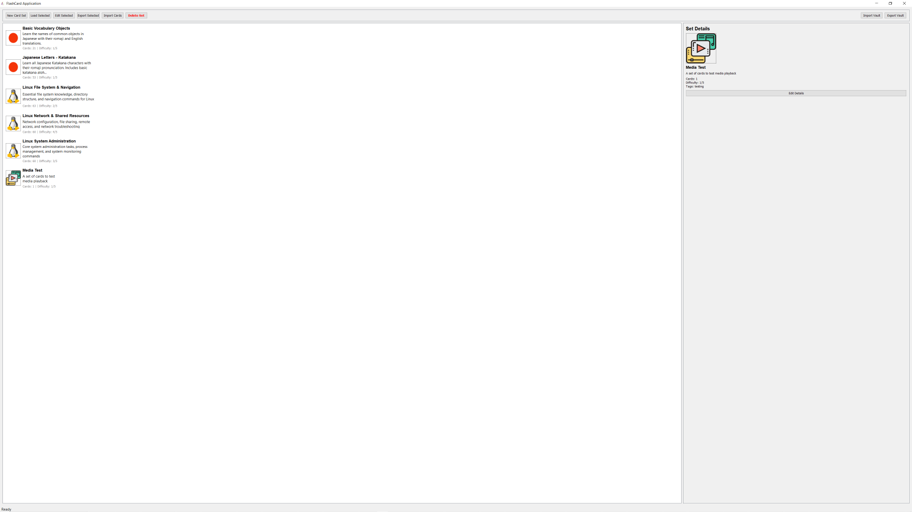
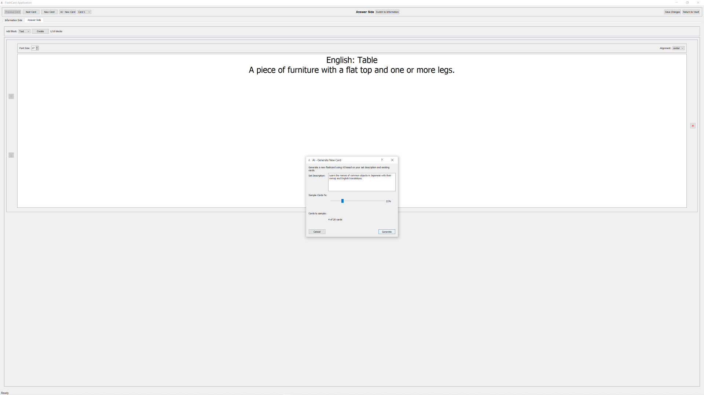

# FlashCard Application

An advanced PyQt5-based flash card application for creating, editing, and studying flash card sets with multimedia content support and AI-powered card generation.

## Comments

Thank you for checking out my application! What started as a simple need to create flash cards turned into a Python development project. This entire application was built using AI-assisted development—I create the plans and guide the AI through implementation.

The project was developed using Claude Sonnet 4 over approximately 10 hours, resulting in about 8,000 lines of code (roughly 1,000 lines per hour!).  For reference the average programmer might write 20 to 200 lines per day.  I wanted this project to demonstrates the level of productivity possible with AI-assisted development.

Getting it running on your machine is really not that hard 😊. The AI features work out of the box since they connect to my hosted server. For full details about the AI server architecture, check out `AI_SERVER_README.md`—it's a Flask server hosted on PythonAnywhere.

**Platform Notes:**
- **macOS**: Works seamlessly out of the box
- **Windows**: Requires **LAVFilters** installation for audio/video playback (the app runs without it, but Qt5 needs codec support for media files)  
## Screen shots
**The Vault**


**Card Editing** 


**AI**



## Features

### Application Modes
- **Vault Mode**: Main interface for managing flash card sets
- **Edit Mode**: Create and modify flash cards with rich content
- **View Mode**: Study interface with progress tracking

### Content Types
- **Text blocks**: Rich text with formatting options
- **Image blocks**: PNG/JPG images (max 3840x2160 pixels)
- **Audio blocks**: WAV/MP3 audio files with player controls
- **Video blocks**: MP4 video files (max 5 minutes) with player controls

### Key Features
-- Multiple content blocks per card side (max 10 blocks)
- Drag-and-drop block reordering
- Progress tracking and study statistics
- Set import/export functionality
- Vault backup and restore
- Custom icon support
- Multiple study modes (Sequential, Random, Review)
- **AI Card Generation**: Automatically generate flash cards using AI (Together.ai integration). Create cards from concepts, summaries, or questions with a single click.

## Requirements

- Python 3.8+ (recommended: Python 3.10+)
- PyQt5 >= 5.15.0
- Pillow >= 8.0.0

### Windows-Specific Requirements

For proper audio and video playback on Windows systems, **LAVFilters** must be installed:

- **LAVFilters**: DirectShow multimedia filters for enhanced audio/video codec support
  - Download from: https://github.com/Nevcairiel/LAVFilters/releases
  - Installation file included: `LAVFilters-0.80-Installer.exe`
  - Additional installation resources: `windows_install/` folder
  - **Required for**: MP4, AVI, MOV, MKV video playback and various audio formats
  - **Installation**: Run as Administrator and follow the installer prompts

LAVFilters provides ffmpeg-based DirectShow splitter and decoders that enable the FlashCard application to play virtually any multimedia format on Windows systems.

## Installation

### Option 1: Automated Installation (Recommended)

The project includes automated installation scripts that handle virtual environment creation and dependency installation:

**Windows (PowerShell):**
```powershell
.\install_flashcards_windows.ps1
```

**macOS/Linux (Bash):**
```bash
chmod +x install_flashcards.sh
./install_flashcards.sh
```

These scripts will:
- Create a Python virtual environment named `flash_cards`
- Activate the environment
- Upgrade pip to the latest version
- Install all required dependencies from `requirements.txt`

### Option 2: Manual Installation

**1. Clone or download the application files**

**2. Create and activate a virtual environment (recommended):**

Windows (Command Prompt):
```cmd
python -m venv flash_cards
flash_cards\Scripts\activate
```

Windows (PowerShell):
```powershell
python -m venv flash_cards
.\flash_cards\Scripts\Activate.ps1
```

macOS/Linux:
```bash
python3 -m venv flash_cards
source flash_cards/bin/activate
```

**3. Install Python dependencies:**
```bash
pip install --upgrade pip
pip install -r requirements.txt
```

**4. Run the application:**
```bash
python flashcards.py
```

### Running the Application

After installation, you can use the provided run scripts:

**Windows:**
```powershell
.\run_flashcards_windows.ps1
```

**macOS/Linux:**
```bash
chmod +x run_flashcards.sh
./run_flashcards.sh
```

Or manually activate the environment and run:
```bash
# Windows
.\flash_cards\Scripts\Activate.ps1
python flashcards.py

# macOS/Linux
source flash_cards/bin/activate
python flashcards.py
```

## Directory Structure

```
FlashCards/
├── flashcards.py              # Main application entry point
├── LAVFilters-0.80-Installer.exe # Windows multimedia codec installer
├── windows_install/           # Windows-specific installation resources
├── config/
│   └── app_config.json       # Application configuration
├── models/                    # Data models
│   ├── flashcard.py          # FlashCard and FlashCardSet classes
│   └── content_blocks.py     # Content block implementations
├── vault/                     # Vault management
│   ├── vault_manager.py      # Vault operations
│   └── icon_manager.py       # Icon management
├── utils/                     # Utility classes
│   ├── config_manager.py     # Configuration management
│   ├── error_logger.py       # Error logging
│   └── file_manager.py       # File operations
├── ui/                        # User interface
│   ├── vault_mode.py         # Vault interface
│   ├── edit_mode.py          # Edit interface
│   ├── view_mode.py          # Study interface
│   └── media_widgets.py      # Media player widgets
├── vault/                     # User flash card data
│   └── sets/                 # Individual card sets
├── icons/                     # Icon collections
│   └── default/              # Default icon set
├── cache/                     # Application cache
├── logs/                      # Error logs
└── temp/                      # Temporary files
```

## Usage

### Creating a New Flash Card Set

1. Click "New Card Set" in the vault interface
2. Enter set name, description, and metadata
3. Select or upload a custom icon
4. The application will create the set and switch to edit mode

### AI Card Generation

1. In Edit Mode, click the "Generate with AI" button to create new flash cards automatically.
2. Enter a concept, topic, or question prompt.
3. The application will use the integrated AI server to generate flash card content (question/answer, explanations, or study guides).
4. Review and edit the generated card before saving.

**Note:** The AI server must be running and configured with a valid Together.ai API key. See `flask_app_pa_v2.py` and `AI_SERVER_README.md` for setup instructions.

### Editing Flash Cards

1. Select a set in the vault and click "Edit Selected"
2. Navigate between cards using Previous/Next buttons
3. Switch between Information and Answer sides
4. Add content blocks using the dropdown and Create button
5. Reorder blocks using up/down arrows
6. Delete blocks using the X button
7. Save changes and return to vault

### Studying Flash Cards

1. Select a set in the vault and click "Load Selected"
2. Use Previous/Next buttons or arrow keys to navigate
3. Press Spacebar or click the card to flip between sides
4. Mark cards as Known (K), Review (R), or Unknown (U)
5. Switch study modes: Sequential, Random, or Review Only
6. View session statistics and progress

### Import/Export

**Export Individual Set:**
- Select set and click "Export Selected"
- Save as ZIP file for sharing

**Export Entire Vault:**
- Click "Export Vault" to backup all sets

**Import Vault:**
- Click "Import Vault" to restore from backup
- Choose merge or replace options

## Keyboard Shortcuts

### Study Mode
- **Left/Right Arrow**: Navigate between cards
- **Spacebar**: Flip card
- **K**: Mark Known
- **R**: Mark Review
- **U**: Mark Unknown

## Configuration

The application stores configuration in `config/app_config.json`:

```json
{
    "window": {
        "width": 1024,
        "height": 768,
        "maximized": false
    },
    "vault": {
        "last_opened": "",
        "path": "./vault"
    },
    "preferences": {
        "theme": "default",
        "auto_save": true
    }
}
```

## Data Storage

Flash card data is stored in JSON format:

- **Set metadata**: `vault/sets/<set_name>/set.json`
- **Card data**: `vault/sets/<set_name>/cards.json`
- **Media files**: `vault/sets/<set_name>/images/` and `vault/sets/<set_name>/sounds/`

## Media File Limits

- **Images**: Maximum 3840x2160 pixels (automatically resized if larger)
- **Videos**: Maximum 5 minutes duration
- **Supported formats**:
  - Images: PNG, JPG, JPEG, BMP, GIF
  - Audio: WAV, MP3, M4A, OGG
  - Video: MP4, AVI, MOV, MKV

## Error Handling

- All errors are logged to `logs/error.log`
- Error dialog accessible from status bar
- Auto-recovery for corrupted files
- Automatic backup during vault operations

## Troubleshooting

### Common Issues

1. **Application won't start**
   - Check Python version (3.8+)
   - Verify PyQt5 installation: `pip install PyQt5`
   - Check console for error messages

2. **Media files not playing**
   - **Windows**: Ensure LAVFilters is installed (see Requirements section)
   - Verify file format is supported
   - Check file permissions
   - Ensure PyQt5 multimedia components are installed

3. **Import/Export failures**
   - Check file permissions
   - Verify ZIP file integrity
   - Ensure sufficient disk space

4. **Performance issues**
   - Reduce image sizes
   - Limit video duration
   - Clean up unused media files

### Error Logs

Check `logs/error.log` for detailed error information. The application also maintains an in-memory error history accessible through the error dialog.

## Development

### Architecture

The application follows an MVC (Model-View-Controller) pattern:

- **Models**: Data structures for flash cards, sets, and content blocks
- **Views**: PyQt5 interfaces for different application modes
- **Controllers**: Application logic and mode management

### Adding New Content Block Types

1. Create new block class inheriting from `ContentBlock`
2. Implement required methods: `to_dict()`, `from_dict()`, `validate()`, `get_display_widget()`, `get_edit_widget()`
3. Add to factory function in `content_blocks.py`
4. Update UI dropdown in edit mode

### Adding New Study Modes

1. Extend `StudySessionManager` class
2. Update mode selector in view mode
3. Implement card ordering logic
4. Add to mode mapping in `ViewModeWidget`

## License

This application is provided as-is for educational and personal use.

## Support

For issues or questions:
1. Check the error log in `logs/error.log`
2. Review this documentation
3. Check file permissions and disk space
4. Verify Python and PyQt5 installation